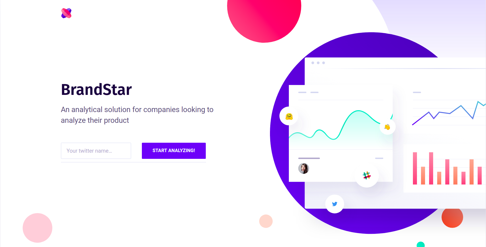
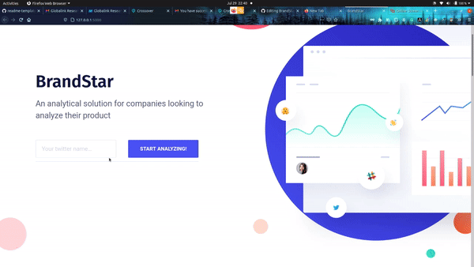

<!-- PROJECT LOGO -->
<p align="center">

  <h3 align="center">BrandStar</h3>
     

  <p align="center">
    BrandStar is a web application built using Flask which provides an analytical solution for the companies who want to analyze their product.

  </p>
  <p align="center">
    <a href="https://devpost.com/software/brandstar">View Demo</a>
    ·
    <a href="https://github.com/lazyCodes7/BrandStar/issues">Report Bug</a>
    ·
    <a href="https://github.com/othneildrew/lazyCodes7/BrandStar/issues">Request Feature</a>
  
  </p>

</p>


<!-- TABLE OF CONTENTS -->
<details open="open">
  <summary>Table of Contents</summary>
  <ol>
    <li>
      <a href="#about-the-project">About The Project</a>
      <ul>
        <li><a href="#built-with">Built With</a></li>
      </ul>
    </li>
    <li>
      <a href="#getting-started">Getting Started</a>
      <ul>
        <li><a href="#prerequisites">Prerequisites</a></li>
        <li><a href="#installation">Installation</a></li>
      </ul>
    </li>
    <li><a href="#usage">Usage</a></li>
    <li><a href="#watch-a-demo">Watch a demo</a>
    <li><a href="#roadmap">Roadmap</a></li>
    <li><a href="#contributing">Contributing</a></li>
    <li><a href="#license">License</a></li>
    <li><a href="#contact">Contact</a></li>
  </ol>
</details>


<!-- ABOUT THE PROJECT -->
## About The Project
There are not tools online that provide a way to analyze your own product. A person could hire an analyst for the same but what if this could be done free-of-cost. This really is the inspiration behind building BrandStar

### Built With

* [Flask](https://flask.palletsprojects.com/en/2.0.x/)
* [NLTK](https://opencv.org/)
* [PyTorch](https://pytorch.org/)
* [Beautiful Soup](https://beautiful-soup-4.readthedocs.io/en/latest/)
* [expert.AI](https://www.expert.ai/)
* [Plotly](https://plotly.com/)
* [Twitter API](https://developer.twitter.com/en/docs/twitter-api)


<!-- GETTING STARTED -->
## Getting Started

Follow the instructions to setup the project locally!

### Prerequisites

Make sure to have virtualenv package from python installed before proceeding to installation.
  ```sh
  pip install virtualenv
  ```

### Installation

1. Clone the repo
   ```sh
   git clone https://github.com/lazyCodes7/BrandStar.git
   ```
2. Activate the virtual environment
   ```sh
   cd BrandStar
   virtualenv venv
   . venv/bin/activate
   ```
3. Install the required packages using pip
   ```sh
   pip install -r requirements.txt
   ```
4. How to get credentials?
For credentials make an account on expert.ai and also a twitter dev account and get the tokens to be used in the steps below.

5. Create a .env file with the credentials you got in step-4
    ```python
    ACCESS_KEY = ""
    ACCESS_SECRET = ""
    CONSUMER_KEY = ""
    CONSUMER_SECRET = ""
    EMAIL= ""
    PASSWORD=""
   ```
6. Run app
    ```sh
    python app.py
    ```
7. Open the link in a web browser
    ```
    127.0.0.1:5000
    ```

<!-- USAGE EXAMPLES -->
## Usage
1. Enter your twitter username
Enter the twitter username in the box and click "Analyze" and wait for the results to show up


2. Interactive dashboard opens and one can save the plot or zoom into the visualizations 


3. Interact with the charts section which has a detailed visualization of your brand like emotional-traits, behavorial-traits using NLP.


4. Analyze the reviews for your brand(Reviews are taken from Trustpilot) 


5. Read the reports


## Watch a demo
The project was built during a hackathon and hence also has a demo video which can be viewed at [Devpost](https://devpost.com/software/brandstar)

<!-- ROADMAP -->
## Roadmap

See the [open issues](https://github.com/lazyCodes7/EthinicAPI/issues) for a list of proposed features (and known issues).


<!-- CONTRIBUTING -->
## Contributing

Contributions are what make the open source community such an amazing place to be learn, inspire, and create. Any contributions you make are **greatly appreciated**.

1. Fork the Project
2. Create your Feature Branch (`git checkout -b feature/AmazingFeature`)
3. Commit your Changes (`git commit -m 'Add some AmazingFeature'`)
4. Push to the Branch (`git push origin feature/AmazingFeature`)
5. Open a Pull Request


<!-- LICENSE -->
## License

Distributed under the MIT License. See `LICENSE` for more information.


<!-- CONTACT -->
## Contact

Rishab Mudliar - [@cheesetaco19](https://twitter.com/cheesetaco19) - rishabmudliar@gmail.com

Telegram: [lazyCodes7](https://t.me/lazyCodes7)


